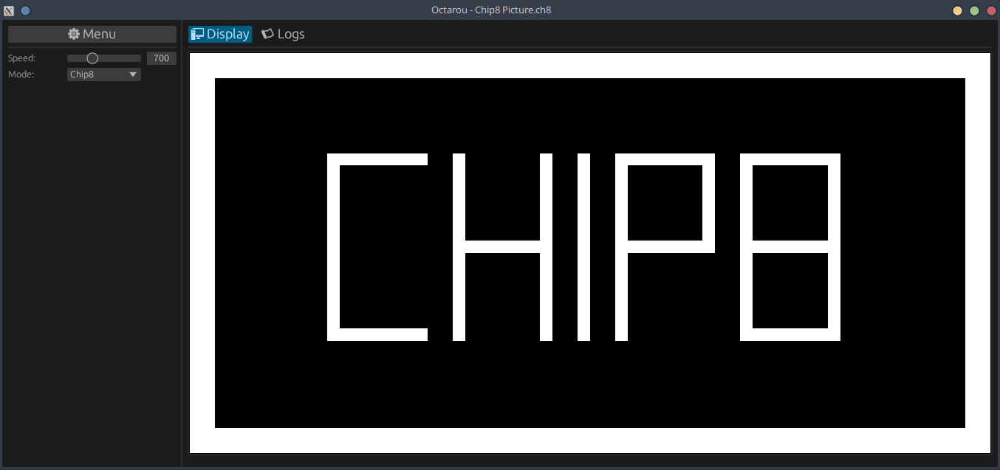

# octarou


A cross-platform CHIP-8 interpreter, featuring a simple UI (powered by [egui](https://github.com/emilk/egui)).
The following platforms are supported:

- Linux
- Windows
- macOS
- Web (parially)

The interpreter fully implements:

- the original COSMAC VIP CHIP-8 instruction set.
- the [SUPER-CHIP 1.1](http://devernay.free.fr/hacks/chip8/schip.txt) extension

I might implement support for other variants (for example, XO-CHIP).

One of my main goals with this project is for it to be as "correct" as possible, so should you discover any issues with this implementation, please feel free to open an issue.



# Building with Nix

The project can be built using the provided Nix flake.

## Linux and \*NIXes

```shell
# build
nix build github:nikoof/octarou
./result/bin/octarou --help
# ...or run it directly
nix run github:nikoof/octarou
```

## Windows

Building for Windows is done via cross-compilation with Nix on a Linux host.

```shell
nix build github:Nikoof/octarou#x86_64-pc-windows-gnu
```

The resulting binary is at `result/bin/octarou.exe`.

# Building manually

Alternatively, you can clone the repo and compile the project natively on all major platforms, provided you have all dependencies for egui installed.

```shell
git clone https://github.com/nikoof/octarou && cd octarou
cargo run --release
```

# Credits

This project would not have been possible without [Tobias Langhoff's Guide](https://tobiasvl.github.io/blog/write-a-chip-8-emulator/) and [Timendus' Test Suite](https://github.com/Timendus/chip8-test-suite). I am extremely grateful to both authors for these amazing resources.

Resources used:

- [Tobias Langhoff's Guide](https://tobiasvl.github.io/blog/write-a-chip-8-emulator/)
- [Timendus' Test Suite and Documentation](https://github.com/Timendus/chip8-test-suite)
- [CHIP-8 Research Facility](https://chip-8.github.io/extensions/)
- [Octo Documentation](http://johnearnest.github.io/Octo/docs/SuperChip.html)
- [Revival Studios ROMs](https://github.com/kripod/chip8-roms)
- [Gulrak's Opcode Table](https://chip8.gulrak.net/)
- [SUPER-CHIP 1.1 Documentation (Erik Bryntse)](http://devernay.free.fr/hacks/chip8/schip.txt)

# License

Copyright (c) Nicolas-Ștefan Bratoveanu, 2023, licensed under the EUPL-1.2-or-later.
